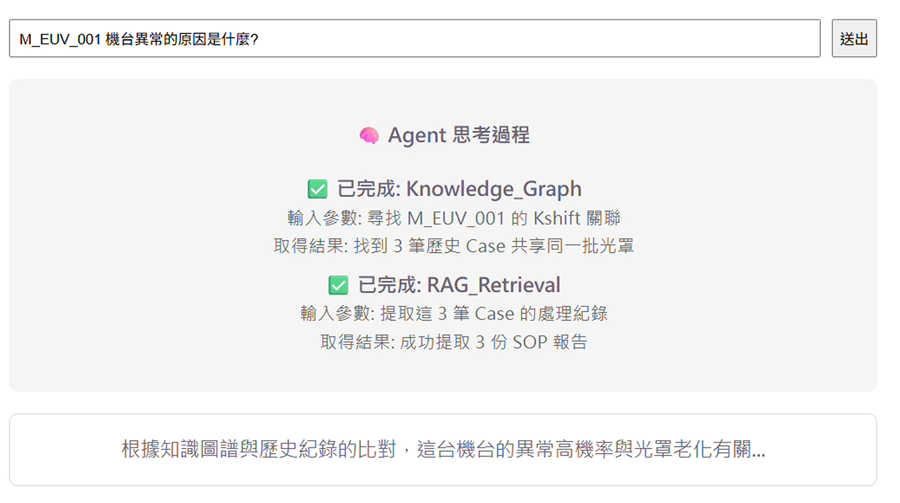

# Demo Stream API & Agent Frontend

這是一個展示如何使用 **FastAPI** 建立 Server-Sent Events (SSE) 串流 API，並搭配 **React (TypeScript + Vite)** 前端來接收與顯示 Agent 思考與生成過程的範例專案。

## 🖼️ 示範截圖 (Demo Image)




## 🎥 示範影片 (Demo Video)
*(`demo_video.mp4` 在此專案的根目錄中。)*

## 專案結構

- `stream_api.py`: Python FastAPI 後端服務，模擬 Agent (例如 LangGraph) 的推理、工具調用與生成過程，並透過 SSE 將即時狀態回傳給前端。
- `requirements.txt`: Python 後端所需的依賴套件清單。
- `agent-frontend/`: React + Vite 前端應用程式，負責連接 SSE API 並在 UI 上動態顯示即時的 Token 串流與 Agent 狀態。

## 🚀 快速開始

### 1. 啟動後端 (FastAPI)

1. 進入專案根目錄。
2. (建議) 建立並啟動虛擬環境：
   ```bash
   python -m venv .venv
   # Windows
   .venv\Scripts\activate
   # macOS/Linux
   source .venv/bin/activate
   ```
3. 安裝所需的 Python 依賴項：
   ```bash
   pip install -r requirements.txt
   ```
4. 啟動 FastAPI 伺服器：
   ```bash
   python stream_api.py
   ```
   > 後端伺服器預設會運行在 `http://127.0.0.1:8000`。

### 2. 啟動前端 (React + Vite)

1. 開啟一個新的終端機視窗，進入前端專案目錄：
   ```bash
   cd agent-frontend
   ```
2. 安裝 Node.js 依賴套件：
   ```bash
   npm install
   ```
3. 啟動前端開發伺服器：
   ```bash
   npm run dev
   ```
   > 打開瀏覽器並前往 `http://localhost:5173` 即可預覽並與 Agent 進行互動。

## 📡 API 說明

- **Endpoint**: `GET /api/chat/stream?query={your_question}`
- **格式**: Server-Sent Events (SSE) `text/event-stream`
- **事件類型**:
  - `status`: Agent 當前狀態 (例如：思考中、總結中)
  - `tool_start` / `tool_end`: 工具調用的開始與結束結果
  - `content_chunk`: LLM 生成的文字片段 (Token 串流)
  - `error`: 錯誤訊息
